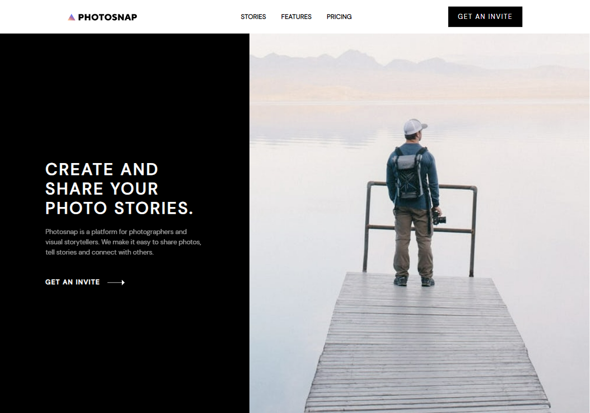

# Frontend Mentor - Photosnap Website solution

This is a solution to the [Photosnap Website challenge on Frontend Mentor](https://www.frontendmentor.io/challenges/photosnap-multipage-website-nMDSrNmNW). Frontend Mentor challenges help you improve your coding skills by building realistic projects. 

## Table of contents

- [Overview](#overview)
  - [The challenge](#the-challenge)
  - [Screenshot](#screenshot)
  - [Links](#links)
- [My process](#my-process)
  - [Built with](#built-with)
- [Author](#author)

**Note: Delete this note and update the table of contents based on what sections you keep.**

## Overview

### The challenge

Users should be able to:

- View the optimal layout for each page depending on their device's screen size
- See hover states for all interactive elements throughout the site

### Screenshot

### Links

- Solution URL: [Add solution URL](https://github.com/dreams65/photosnap-multi-page)
- Live Site URL: [Add live site URL](https://dreams65.github.io/photosnap-multi-page/)

## My process

### Built with

- Semantic HTML5 markup
- Sass
- Flexbox
- CSS Grid
- Mobile-first workflow
- Gulp

### Continued development

- Finalize styles for tablets

## Author

- Frontend Mentor - [@dreams65](https://www.frontendmentor.io/profile/dreams65)
- Twitter - [Mykola Shtefan](https://www.linkedin.com/in/design-n-web-dev/)
